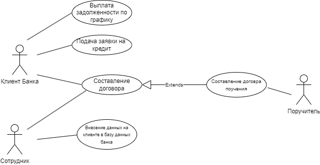

## "Кредитование в банке"

***
 
 
[Содержание](#содержание)

[Введение](#введение)

1. [Описание предметной области](#предметная_область)
2. [Сравнительный анализ](#Сравнительный_анализ)
3. [Разработка системы](#разработка_системы)
***

## Введение 
***

Банки являются важным звеном в функционировании экономики страны и мировой экономики. Банковская система обеспечивает бесперебойность и высокую скорость процесса общественного воспроизводства, повышает эффективность всего производства.

Основное призвание банка - посредничество в перемещении денежных средств от кредиторов к заёмщикам и от продавцов к покупателям.

Кредитование – это финансовые взаимоотношения, в которых одна сторона – кредитодатель, предоставляет во временное пользование ссуду в денежной или натуральной форме, а вторая сторона – заемщик, пользуется предоставленной ссудой на условиях возвратности и возмездности.

### _Формы кредитов_

  1) Банковские кредиты. Это деньги, которые выдают банки: физлицам, предпринимателям и компаниям. Физлица берут кредиты под крупные траты, а организации — на  увеличение оборота и развитие.
Процентную ставку по кредиту банк устанавливает сам на основе ключевой ставки — минимального процента, под который он может взять деньги в долг или сдать на хранение в Центробанк.

 2) Коммерческие кредиты. Коммерческие кредиты иногда называют товарными. Кредитором в этом случае выступает не банк, а юрлицо или ИП. Он передает заемщику — компании или ИП — деньги или товар в рассрочку. Например, компания может заказать продукцию оптом, получить ее сразу, а оплачивать частями.

 3) Государственные кредиты. Одна сторона, кредитор или заемщик — государство, а вторая — юридическое или физическое лицо. Чтобы взять кредит у граждан, государство выпускает облигации — долговые бумаги. Покупая их, физлицо или компания как бы дает деньги в долг государству и может рассчитывать на процентные выплаты.
 ***
 ## 1. Описание предметной области 
***
 
Обслуживание клиентов, которые хотят оформить кредит, должно проходить быстро, тем самым и регистрация клиента должна оформляться быстро. Следовательно, есть необходимость в ускорении данного процесса
В условиях перехода общества в информационную эпоху, все большую и большую актуальность приобретают автоматизированные системы и бизнес-процессы. Следовательно, целью качественной работы банков является разработка автоматизированной системы управления принятия клиентов на обслуживание.
Комплексная автоматизация управления предприятия на сегодняшний день - один из самых эффективных и функциональных инструментов систематизации работы ключевых бизнес-процессов. Зачастую управление бизнес-процессами становится трудоемким, а анализ большого потока первичных данных отнимает много сил, времени.В условиях современной жизни требуется ускорение процессов обработки информации. Этот процесс подлежит автоматизации, так как обработка информации очень долгий, кропотливый и требующий больших ресурсов процес
с.
 
***
## 2. Сравнительный анализ 
В настоящее время практически все банковские организации имею свои собственные приложения, которые позволяют их клиентам совершать различные операции с имеющимися банковскими картами, получать достоверную информацию обо всех операциях, а также совершать платежи, переводы, оплату различных сервисов и погашать свои кредиты и займы с помощью приложения.
***
## 3. Разработка системы 
### _Описание BPMN - модели_

В начале сотрудник вводит данные человека, который подал документы о получении кредита. Дальше сотрудник интересуется целью получения кредита и вводит ее в базу данных. 
Вскоре консультант узнаёт необходимую сумму для кредита, от которой зависит разные условия кредитования, т.е. сумма находящая в диапазоне от 5 до 50 тыс. рублей предполагает заработную плату не менее 30 тыс. рублей и наличие материального имущества под залог; от 50 до 500 тыс. рублей включает в себя заработную плату не менее 60 тыс. рублей и т.д. 
Потом сотрудник узнаёт финансовые возможности кредитора: место работы, заработную плату, наличие недвижимого имущества. Если все необходимые условия соблюдены, консультант вносит полученные сведения в личное дело. Далее идет проверка на непогашенные задолженности. В случае отсутствия их сотрудник финансового учреждения принимает заявку и отправляет её на рассмотрение в течение 5 рабочих дней. После прохождения определенного срока выносится решение, при котором клиент идет подписывать кредитный договор. В противной случае, банк информирует клиента об отказе. В обоих случаях процесс завершается
 
 ### _BPMN модель_

 ### _IDEF модель_
 

 ### _Use Case модель_

Назначение данной диаграммы состоит в следующем: проектируемая информационная система представляется в форме так называемых вариантов использования, с которыми взаимодействуют внешние сущности или акторы. При этом актором или действующим лицом называется любой объект, субъект или система, взаимодействующая с моделируемой бизнес-системой извне. Это может быть человек, техническое устройство, программа или любая другая система, которая служит источником воздействия на моделируемую систему так, как определит разработчик.
Вариант использования служит для описания сервисов, которые система предоставляет актору. Другими словами каждый вариант использования определяет набор действий, совершаемый системой при диалоге с актором. При этом ничего не говорится о том, каким образом будет реализовано взаимодействие акторов с системой и собственно выполнение вариантов использования.

